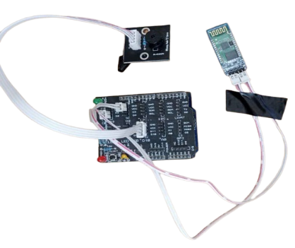

# <a name="_nr6pde6j6np5"></a>**Documentation du Projet : Contrôle d'une LED et d'un Buzzer via Bluetooth avec App Inventor**
# Sommaire
- [Introduction](#_3rwagf9o8c9d)
- [Objectifs](#_bljq7x374ggm)
- [Matériel Utilisé](#_a6b57cevi316)
- [Fonctionnement](#_h1c7xdr8vsf9)
- [Schéma de Connexion](#_jus87tqw3z6p)
- [Code Arduino](#_j0mppyxu7343)
- [Étapes de Réalisation](#_a84wm0r7fwwe)
- [Conclusion](#_omz85osrs5dl)

## <a name="_3rwagf9o8c9d"></a>**Introduction**
Ce projet consiste à contrôler une LED et un buzzer connectés à un Arduino via des commandes vocales envoyées depuis une application Android développée avec **App Inventor**. La communication entre l'application et l'Arduino se fait par Bluetooth, permettant ainsi de piloter à distance le système. L’ ensemble du matériels physiques utilisé dans ce projet provient du kit Steamy Pro 
## <a name="_bljq7x374ggm"></a>**Objectifs**
- Développer une application mobile capable d'envoyer des commandes vocales pour activer/désactiver des dispositifs (LED et buzzer).
- Utiliser un module Bluetooth pour la communication entre l'application et l'Arduino.
## <a name="_a6b57cevi316"></a>**Matériel Utilisé**
- **Arduino UNO** avec un shield (Steamy Pro).

  


- **Module Bluetooth HC-06** pour la communication sans fil.

  

- **LED Rouge** pour l'indication visuelle.

  

- **Buzzer** pour l'indication sonore.

  


- **Application Android** créée avec **App Inventor**.

  
## <a name="_h1c7xdr8vsf9"></a>**Fonctionnement**
L'application mobile permet d'envoyer des commandes vocales telles que "Allume lumière", "Éteins lumière", "Activer buzzer" et "Désactiver buzzer". Ces commandes sont converties en signaux Bluetooth et envoyées à l'Arduino, qui interprète les signaux pour exécuter les actions correspondantes.

Lorsque l'arduino reçoit un signal :

- Pour la commande "allume lumière", une tension est appliquée à la broche de la LED pour l'allumer.
- Pour la commande "éteins lumière", la tension est coupée, éteignant ainsi la LED.
- Pour la commande "activer alarme", une impulsion est envoyée au buzzer pour qu'il émette un son.
- Pour la commande "désactiver alarme", le buzzer est arrêté.
## <a name="_jus87tqw3z6p"></a>**Schéma de Connexion**
Les connexions entre les composants se présentent comme suit :

- La LED est connectée à la broche numérique D13.
- Le buzzer est connecté à la broche D10.
- Le module Bluetooth HC-06 est connecté aux broches TX (pin 2) et RX (pin 3) de l'Arduino pour la communication série.


## <a name="_j0mppyxu7343"></a>**Code Arduino**
Voici le code utilisé pour contrôler la LED et le buzzer en fonction des commandes reçues via Bluetooth :

```C++

#include <SoftwareSerial.h>

#define led 13

#define buzzer 10

SoftwareSerial bluetooth(2, 3); // TX sur pin 2, RX sur pin 3

void setup() {

  // Initialiser la communication avec le moniteur série (pour voir les données dans le terminal)

  Serial.begin(9600);


  // Initialiser la communication série pour le module Bluetooth

  bluetooth.begin(9600);

  pinMode(led, OUTPUT);

  pinMode(buzzer, OUTPUT);

}

void loop() {

  if (bluetooth.available() > 0) {

    // Lire la donnée reçue via Bluetooth

    String data = bluetooth.readString();

    Serial.print("Donnée reçue : ");

    Serial.println(data);

    if (data == "A"){

      digitalWrite(led, HIGH);

    }else if (data == "E"){

      digitalWrite(led, LOW);

    }else if (data == “B”){

      digitalWrite(buzzer, HIGH);

    }else if (data == “D”){

      digitalWrite(buzzer, LOW);

    }


  }

}

```

L'application a été développée avec **App Inventor** grâce aux outils suivants: 1 ListPicker, 1 button, 1 label, 1 BluetoothClient, 1 SpeechRecognizer, 1 Clock.Elle dispose des fonctionnalités suivantes :

- Un bouton pour lister les appareils bluetooth permettant à l’utilisateur de se connecté à l’Arduino. Cette fonctionnalité est mise en place grâce à la construction de blocs suivantes:

   

- Les commandes vocales sont analysées grâce au système de reconnaissance vocale de Google puis sont envoyées sous forme de caractères spécifiques (par exemple : "A" pour allumer la LED, "E" pour éteindre la LED, "B" pour activer le buzzer, "D" pour désactiver le buzzer).

  

  **Interface de l’application**

                    ****

## <a name="_a84wm0r7fwwe"></a>**Étapes de Réalisation**
1. **Développement de l'application** :
   L'application est conçue pour capter la voix, interpréter les commandes, puis envoyer les instructions via Bluetooth.
1. **Mise en place du matériel** :
   L'Arduino est monté avec son shield. Le module Bluetooth est connecté aux broches RX et TX de l'Arduino. La LED et le buzzer sont installés sur les broches D12 et D13 respectivement.
1. **Programmation de l'Arduino** :
   Le code Arduino écoute les signaux Bluetooth et exécute les commandes pour allumer ou éteindre la LED, et activer ou désactiver le buzzer.
1. **Test et validation** :
   Après l’installation, des tests ont été effectués pour s'assurer que les commandes vocales sont correctement interprétées et que les actions associées sont exécutées par l'Arduino.
##
## <a name="_omz85osrs5dl"></a><a name="_x9i8163xlz98"></a>**Conclusion**
Ce projet démontre comment les commandes vocales peuvent être utilisées pour contrôler des appareils électroniques via une application mobile et un module Bluetooth. Il pourrait être étendu à d'autres périphériques pour des projets plus complexes.

